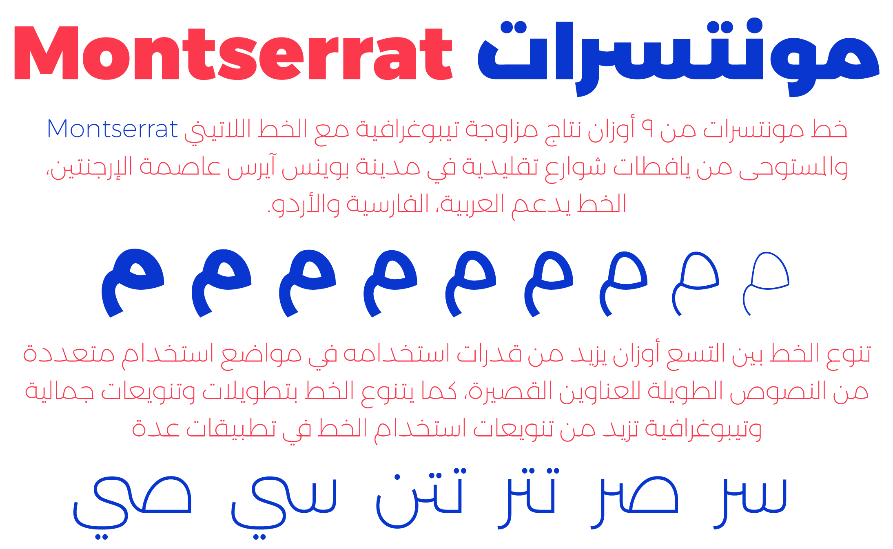

# Montserrat-Arabic

Montserrat arabic is a 9 weights font family made in matching to the latin type Montserrat by [Julieta Ulanovsky](https://fonts.google.com/specimen/Montserrat) which was inspired by the old posters and signs in the traditional Montserrat neighborhood of Buenos Aires.

Having the fontfamily of nine weights increases the ability to use the font in various applications, from long text using the light weights to short headlines using the heavy thick weights. 

Note that the font family in a recent version 5.007 I used connecting components, font must be generated by Glyphs.

The Montserrat-Arabic project is led by Mohamed Gaber, a type designer based in Cairo, Egypt. 
To contribute, see [github.com/Gue3bara/Montserrat-Arabic](https://github.com/Gue3bara/Montserrat-Arabic)
